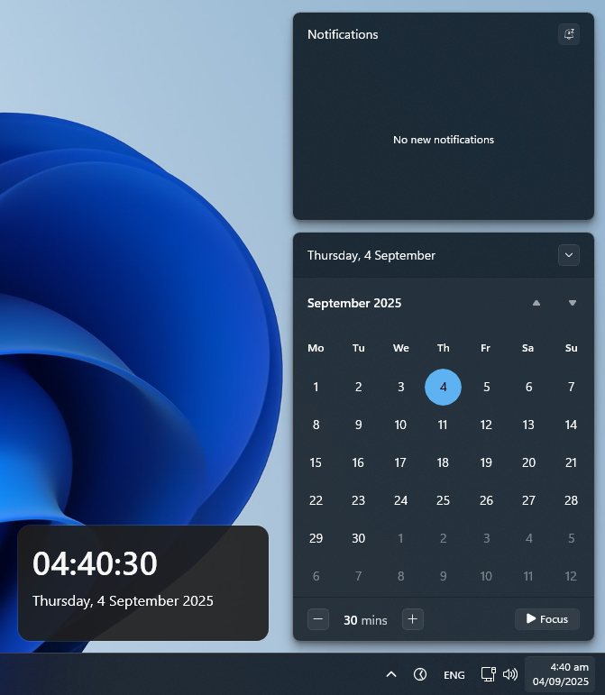
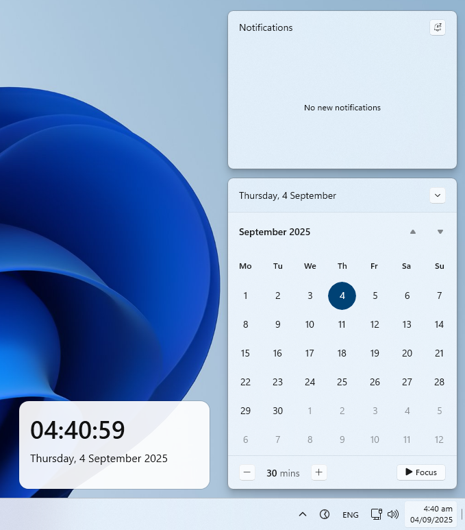
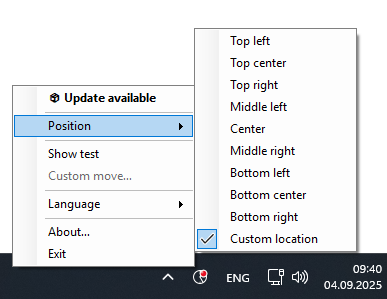
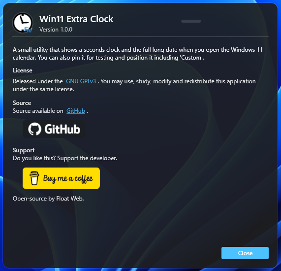

# Win11 Extra Clock ⏰

      

Restore the Windows 10 clock on Windows 11. Open the taskbar calendar and a small flyout shows a **clock with seconds** and the **long date**, using your system locale. Theme-aware, with nine preset positions and a custom drag-to-place mode.

> Current version: **1.0.0**

---

## Features ✨

✅ Seconds display and long date in the calendar flyout  
✅ Lightweight tray icon with an **update badge** 🔴  
✅ Tray menu entry when a new update is released: **“Update available”**  
✅ Calendar flyout detection for smooth show/hide  
✅ Can run independently of the calendar via **Test mode**  
✅ Position presets (Top-Left/Center/Right, Center, Bottom-Left/Center/Right) and **Custom** offset  
✅ Theme-aware icons and UI (Light/Dark)  
✅ No telemetry, minimal footprint 🪶

---

## Screenshots 📸

| Flyout — Dark | Flyout — Light |
|---|---|
|  |  |

Tray & badge | About
:--:|:--:
 | 

---

## Download & Install 📦

1. Get the **installer** from the [Releases](https://github.com/floatweb/win11-extra-clock/releases) page  
   (e.g. `Win11ExtraClock-x64-*version*.msi`).
2. Run the installer and follow the steps.
3. Optional: keep the icon always visible via  
   **Settings → Personalization → Taskbar → Other system tray icons** → turn **On** for “Win11 Extra Clock”.

**Requirements**

- Windows 11 **build 22000+** (21H2 or newer).  
- x64 system.

### ⚠️ Code signing & SmartScreen ⚠️

The installer and executable are **not code-signed yet**. On first run, Windows SmartScreen may warn that the app is from an unknown publisher.

If that happens:
1. Click **More info**  
2. Click **Run anyway**

We plan to sign future releases. Until then, you can verify the download by checking the attached **SHA-256 checksum** and by downloading only from this GitHub repository.

---

## Usage 🧭

### Open the flyout (normal)
- Click the **time/date** area on the Windows taskbar (the built-in tray clock).
- The Windows calendar opens and **Win11 Extra Clock** appears alongside it (seconds + long date).
- Close it by clicking the time/date again or anywhere outside the flyout.

### Test mode (no calendar needed)
- Open the tray menu → **Show Test**
- This shows the clock flyout without the Windows calendar, so you can position it anywhere you want and preview it. 
- The **Custom move...** become active only when the position is set to **Custom** and the **Show Test** is active.
- Close it by uncheck it from tray menu.

### Tray icon & updates
- Click the app’s tray icon to open the menu (About, Exit, Position…).
- When a new version is out, the tray icon shows a small red badge and the menu displays **Update available** (bold).  
  Click it to open the latest release.

### Position presets
- Tray menu → **Position** → choose **Top-Left / Top-Right / Bottom-Left / Bottom-Right / etc.**, or **Custom** to fine-tune offsets.

### Start with Windows (selected during setup)
- The option **Start with Windows** is already checked in the installer, the app launches automatically on sign-in.  
  You can toggle this later from the Start-up folder or by reinstalling and changing the option.  

---

## Updates 🔄
The app checks for updates **on startup** and then **periodically** (default every 2 hours).  
It reads a plain-text version file:
`https://raw.githubusercontent.com/floatweb/win11-extra-clock/main/version.txt` 

---

### Optimisations:
-   Uses **ETag / 304** to avoid unnecessary traffic
-   Optional fallback to GitHub Releases API
-   No personal data is sent, only a simple HTTP GET

A small log is written to:
`%LOCALAPPDATA%\Win11ExtraClock\update.log`

---

## Translations 🌐
Language files live in `languages/`. Add a JSON file with your strings.
Switching language applies at runtime.

---

## Privacy 🔐
-   No telemetry.
-   Network calls are only made to read the version text (and the GitHub releases endpoint if enabled).

---

## Build from source 🧰
**Prereqs**
-   Windows 11
-   Visual Studio 2022 (with “.NET Desktop Development”)
-   .NET 8 SDK

**Project versioning (`.csproj`)**

    <PropertyGroup>
      <Version>1.0.0</Version>
      <AssemblyVersion>1.0.0.0</AssemblyVersion>
      <FileVersion>1.0.0.0</FileVersion>
      <Company>Float Web</Company>
      <Product>Win11 Extra Clock</Product>
      <Authors>Float Web</Authors>
      <Copyright>© 2025 Float Web</Copyright>
      <ApplicationIcon>Assets\Win11ExtraClock_AppIcon.ico</ApplicationIcon>
      <SupportedOSPlatformVersion>10.0.22000.0</SupportedOSPlatformVersion>
    </PropertyGroup>

> Keep `version.txt` in the repo root in sync (e.g. `1.0.0`).

Build steps:
1.  Open the solution in Visual Studio → set **Release | x64**.
2.  Build the solution.
3.  The installer (e.g. `Win11ExtraClock-x64-*version*.msi`) is the recommended distribution.

---

## Project structure

    Win11 Extra Clock/
    ├─ assets/                    # icons & images (tray, logo, about)
    ├─ languages/                 # translations
    ├─ Services/
    │  ├─ UpdateService.cs        # version check (ETag, fallback)
    │  ├─ CalendarDetector.cs     # calendar flyout detection
    │  ├─ PreciseSecondTimer.cs   # second-precise timer
    │  └─ AppState.cs             # shared state (UpdateAvailable, etc.)
    ├─ Tray/TrayIcon.cs           # NotifyIcon, menu, badge
    ├─ UI/
    │  ├─ FlyoutWindow.xaml       # clock/date UI
    │  └─ AboutWindow.xaml        # About page
    ├─ Win32/NativeMethods.cs
    ├─ App.xaml / App.xaml.cs
    └─ README.md

---

## Roadmap 🗺️
-   In-app guided update flow
-   Extra date/time format tweaks
-   CI for reproducible builds (GitHub Actions)
-   More translations

---

## Contributing 🤝
Issues and PRs are welcome. Please keep changes focused (one improvement per PR) and include a short description and screenshots where it helps.

---

## License 📄
Released under the **GNU GPLv3**. See LICENSE.

---

## Support the project 💖
If Win11 Extra Clock saves you time or you simply enjoy using it, you can support ongoing development:

